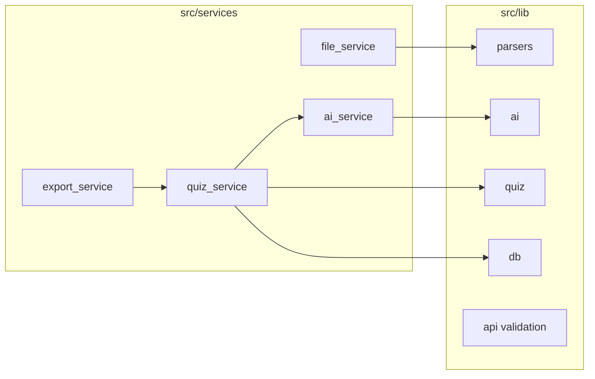

# Architecture

**Project:** Quiz Generator (`680-quiz-generator`)  
**Language:** TypeScript  
**Framework:** Next.js **16** (App Router), React 19  

This document is kept in sync with the intent of [`architecture.xlsx`](../architecture.xlsx) (planning workbook) and with the **current repository**. Where the spreadsheet describes future or alternate designs, a **Repo note** calls out the actual implementation.

Teachers upload study material, configure quizzes, and run AI generation; students take quizzes and view results. **PostgreSQL** + **Drizzle ORM** persist data; **Better Auth** handles sessions and email/password sign-in. **Vercel AI SDK** + **`@ai-sdk/anthropic`** drive structured quiz generation (`generateObject` + Zod).

---

## 1. Document overview

- Full-stack Next.js App Router app with route handlers for uploads, generation, attempts, and PDF export.
- AI path: Anthropic Claude via `ai` / `@ai-sdk/anthropic`, with prompt text from [`src/lib/ai/prompt_builder.ts`](../src/lib/ai/prompt_builder.ts) and schemas in [`src/lib/ai/quiz_output_schema.ts`](../src/lib/ai/quiz_output_schema.ts).
- **Repo note:** Quiz generation today is **non-streaming** JSON in `POST /api/generate` (not a streaming `ReadableStream` of partial questions). Streaming remains a possible enhancement vs the spreadsheet.

---

## 2. Framework decision

| Framework | Verdict | Rationale | Trade-offs |
|-----------|---------|-----------|------------|
| **Next.js (App Router)** | Selected | API routes for uploads and AI; RSC where useful; single deploy unit; strong TS; KaTeX, jsPDF, UI stack fit naturally. | Opinionated routing; more concepts than a minimal API server. |
| TanStack Start | Not selected | Pre-1.0 surface for this product’s timeframe. | Ecosystem maturity. |
| Express + Vite | Not selected | Two apps, CORS, duplicate tooling for this scope. | Operational overhead. |

**Repo note:** Spreadsheet text references **Next.js 15**; `package.json` uses **Next.js 16**.

---

## 3. Tech stack

| Layer | Technology (xlsx / repo) | Purpose | Repo notes |
|-------|--------------------------|---------|------------|
| Frontend | Next.js 16 App Router | Full-stack React, RSC + client components | Use Server Components where they simplify data loading. |
| Language | TypeScript 5.x | End-to-end typing | `strict` in TS config. |
| AI / LLM | `ai` + `@ai-sdk/anthropic` | Structured generation via `generateObject` | Zod schema in [`quiz_output_schema.ts`](../src/lib/ai/quiz_output_schema.ts); retries/backoff in [`ai_service.ts`](../src/services/ai_service.ts). |
| Prompt caching | Anthropic `cacheControl` | Lower latency/cost on repeated system prompts | `providerOptions.anthropic.cacheControl` in `generateObject`. |
| Database | **PostgreSQL + Drizzle ORM** | Users, quizzes, questions, attempts, files | **Not Prisma** — schema in [`src/lib/db/schema.ts`](../src/lib/db/schema.ts); Drizzle Kit migrations. |
| Auth | **Better Auth** v1 | Email/password, sessions | [`src/lib/auth/`](../src/lib/auth/); role on `users`. |
| File storage | xlsx: Local/S3 + presigned URLs | Binary storage | **Repo:** uploads persist **extracted text** in `uploaded_files`; `storagePath` may be empty — treat S3/presigns as **production hardening**, not implemented in tree. |
| PDF parsing | `pdf-parse` v2 | Text from PDF buffers | [`pdf_parser.ts`](../src/lib/parsers/pdf_parser.ts) sets worker `file:` URL for Next bundling; `PDFParse({ data: buffer })`. |
| PPT parsing | xlsx: pptx-parser / officegen | Slide text | **Repo:** [`ppt_parser.ts`](../src/lib/parsers/ppt_parser.ts) uses **temp file + `python3` + zipfile** against PPTX XML (not npm pptx-parser). |
| LaTeX | KaTeX + `react-katex` | Math in questions | [`latex_text.tsx`](../src/components/quiz/latex_text.tsx). |
| Export | jsPDF + jspdf-autotable | Quiz + answer key PDF | [`export_service.ts`](../src/services/export_service.ts). |
| Styling | Tailwind CSS 4 + **Base UI**-style primitives | UI in `components/ui` | shadcn-style file layout; see `components.json` if using shadcn CLI. |
| Testing | **Vitest** (+ Testing Library in devDeps) | Unit / component tests | **Playwright is not in `package.json` today** — add for E2E when you implement flows from the spreadsheet. Coverage gate in [`vitest.config.ts`](../vitest.config.ts). |
| Package manager | pnpm (recommended) / npm | Lockfile and installs | Repo works with either; CI/local choice is team preference. |

---

## 4. Project structure

Paths below reflect **what exists in the repo**. Entries from `architecture.xlsx` that are **not** present are marked *planned / not in repo*.

| Path | Type | Description | Notes |
|------|------|-------------|--------|
| [`src/app/page.tsx`](../src/app/page.tsx) | Page | Marketing / entry | |
| [`src/app/(auth)/login/`](../src/app/(auth)/login/) | Page | Login | Role-based redirect after sign-in (client + session). |
| [`src/app/(auth)/register/`](../src/app/(auth)/register/) | Page | Registration | |
| [`src/app/teacher/create/`](../src/app/teacher/create/) | Page | Upload + configure + generate wizard | US-002 … US-007 traceability in xlsx. |
| [`src/app/teacher/quizzes/`](../src/app/teacher/quizzes/) | Page | Quiz list | Export entry points toward `GET /api/export`. |
| [`src/app/teacher/quizzes/[quizId]/`](../src/app/teacher/quizzes/[quizId]/) | Page | Quiz detail / delete | |
| [`src/app/student/take/[quizId]/`](../src/app/student/take/[quizId]/) | Page | Take quiz | [`quiz_runner.tsx`](../src/app/student/take/[quizId]/quiz_runner.tsx), [`use_quiz_timer.ts`](../src/app/student/take/[quizId]/use_quiz_timer.ts), [`use_quiz_submission.ts`](../src/app/student/take/[quizId]/use_quiz_submission.ts). |
| [`src/app/student/practice/create/`](../src/app/student/practice/create/) | Page | Student self-practice | Reuses [`CreateQuizWizard`](../src/components/quiz/create_quiz_wizard.tsx); generated quizzes are `PRIVATE` to the student. |
| [`src/app/student/results/[attemptId]/`](../src/app/student/results/[attemptId]/) | Page | Attempt results | **Repo:** dynamic segment is **`attemptId`**, not `[quizId]` (xlsx typo). |
| [`src/app/api/upload/route.ts`](../src/app/api/upload/route.ts) | API | Multipart upload → extract text → `uploaded_files` | |
| [`src/app/api/generate/route.ts`](../src/app/api/generate/route.ts) | API | Create quiz from `fileId` + config | Uses [`parseGenerateBody`](../src/lib/api/request_validation.ts). |
| [`src/app/api/attempts/route.ts`](../src/app/api/attempts/route.ts) | API | Submit attempt, return score / `attemptId` | **Replaces** xlsx `POST /api/quizzes/[id]/attempt` style. |
| [`src/app/api/export/route.ts`](../src/app/api/export/route.ts) | API | `?quizId=` → PDF | US-010. |
| [`src/app/api/auth/[...all]/route.ts`](../src/app/api/auth/[...all]/route.ts) | API | Better Auth catch-all | |
| *`src/app/api/quizzes/route.ts`* | — | *xlsx only* | **Not in repo** — quiz CRUD is mostly server-rendered pages + generate route. |
| *`src/app/api/analytics/route.ts`* | — | *xlsx only* | **Not in repo** — analytics would be new work (US-009/010 depth). |
| [`src/lib/ai/prompt_builder.ts`](../src/lib/ai/prompt_builder.ts) | Library | User + system prompt assembly | |
| [`src/lib/ai/models.ts`](../src/lib/ai/models.ts) | Library | `resolveModelId` / `selectModel` | **Replaces** xlsx `anthropic_client.ts` singleton. |
| [`src/lib/ai/quiz_output_schema.ts`](../src/lib/ai/quiz_output_schema.ts) | Library | Zod schemas for `generateObject` | |
| [`src/lib/api/request_validation.ts`](../src/lib/api/request_validation.ts) | Library | Typed body/query validation for APIs | |
| [`src/lib/parsers/`](../src/lib/parsers/) | Library | `txt_parser`, `pdf_parser`, `ppt_parser` | |
| [`src/lib/quiz/`](../src/lib/quiz/) | Library | Grading, payloads, timer helpers, `post_student_attempt` | |
| [`src/lib/db/`](../src/lib/db/) | Library | Drizzle client + schema | **Not** `prisma/schema.prisma` or `prisma_client.ts`. |
| [`src/services/`](../src/services/) | Services | `file_service`, `ai_service`, `quiz_service`, `export_service` | |
| [`src/types/`](../src/types/) | Types | `quiz.ts`, `user.ts` | |
| [`src/components/`](../src/components/) | UI | Nav, quiz widgets, `ui/*` | |
| [`tests/unit/`](../tests/unit/) | Tests | Vitest; `test_*.test.ts` | |
| *`tests/e2e/`* | — | *xlsx* | **Not in repo** until Playwright (or similar) is added. |

---

## 5. Naming conventions (from architecture spec)

| Element | Convention | Example |
|---------|------------|---------|
| Variables / parameters | camelCase | `questionCount`, `extractedText` |
| Function args | Destructured object when arity grows | `createQuiz({ title, ownerId, ... })` |
| Classes / interfaces | PascalCase, no `I` prefix | `QuizConfig`, `PdfParseError` |
| DB identifiers (SQL) | snake_case | `owner_id`, `quiz_id` (Drizzle maps from TS field names in schema) |
| Constants | UPPER_SNAKE_CASE | `MAX_RETRIES`, `MIN_TEXT_LENGTH` |
| Files | snake_case | `quiz_service.ts`, `pdf_parser.ts` |
| React components | PascalCase file + export | `QuizRunner`, `NavBar` |
| API entrypoints | `route.ts` | App Router convention |
| Tests | `test_*.test.ts` under `tests/unit/` | `test_file_service.test.ts` |
| Env vars | UPPER_SNAKE_CASE | `DATABASE_URL`, `ANTHROPIC_API_KEY` |
| User story IDs | US-NNN | Trace requirements in xlsx |

---

## 6. Error handling

- **Typed errors** in services with `readonly code` (e.g. `INVALID_FILE_TYPE`, `GENERATION_FAILED`, `QUOTA_EXCEEDED`, `PDF_PARSE_FAILED`).
- **API JSON shape:** `{ error: true, code, message }` for client-visible failures.
- **HTTP semantics:** 400 validation, 413 oversized upload, 422 short content, 429 quota, 500 unexpected.
- **AI retries:** `ai_service` retries 429/529 with exponential backoff up to `MAX_RETRIES`.
- **Logging:** structured `console.error` objects with `component` field on some routes.

---

## 7. User stories (summary)

Full acceptance text lives in `architecture.xlsx` (sheet rows ~US-001–US-011). Summary:

| ID | Theme |
|----|--------|
| US-001 | Student uploads notes for quizzing |
| US-002 | Teacher sets question count (validated range) |
| US-003 / US-004 | Multi-format upload (.pdf, .ppt/.pptx, .txt) |
| US-005 | Difficulty selection drives prompt |
| US-006 | LaTeX in math content (`$$...$$`) + KaTeX |
| US-007 | Quiz type selection (MC, short answer, fill-in, reading) |
| US-008 | Optional time limit + countdown / auto-submit |
| US-009 | Results show correct/incorrect + score |
| US-010 | Performance / analytics views (partially aspirational) |
| US-011 | PDF export of quiz + answer key |

**Repo coverage:** upload, generate, take, results, export are implemented at varying depth; dedicated analytics API/dashboard slices from US-010 may still be thin vs the spreadsheet.

---

## 8. Data model (Drizzle)

Authoritative schema: [`src/lib/db/schema.ts`](../src/lib/db/schema.ts). Conceptual alignment with the xlsx Prisma summary:

| Concept | Drizzle / notes |
|---------|-----------------|
| User | `users` (+ Better Auth `sessions`, `accounts`, `verifications`) |
| Quiz | `quizzes` — `quizType`, `difficulty`, optional `timeLimitMinutes`, `visibility` (`SHARED` \| `PRIVATE`) |
| Question | `questions` — JSON `options` for MC; `correctAnswer`, `hasLatex`, `orderIndex` |
| Attempt | `attempts` — `score`, `submittedAt` |
| Answer | `answers` — per-question correctness |
| Uploaded file | `uploaded_files` — `extractedText`, metadata |

---

## 9. AI integration (actual behavior)

| Concern | Implementation |
|---------|----------------|
| Model selection | [`resolveModelId`](../src/lib/ai/models.ts) — advanced model for reading comprehension or `questionCount > 30`; else `ANTHROPIC_MODEL` or default Sonnet. |
| Prompt caching | `providerOptions.anthropic.cacheControl: { type: 'ephemeral' }` on `generateObject`. |
| Structured output | `generateObject` + Zod; **not** tool-use / manual JSON regex. |
| Prompts | [`SYSTEM_PROMPT`](../src/lib/ai/prompt_builder.ts) + [`buildUserPrompt`](../src/lib/ai/prompt_builder.ts) (difficulty rubric + per-quiz-type instructions). |
| Retries | 429/529 → backoff; other errors → `GenerationFailedError`. |

---

## 10. File processing pipeline

| Step | Location | Notes |
|------|----------|--------|
| 1. Upload | [`POST /api/upload`](../src/app/api/upload/route.ts) | Session required; `owner_id` from session; `parseUploadForm` (file only); per-user rate limit; `extractTextFromFile`. |
| 2. Type / size gates | [`file_service.ts`](../src/services/file_service.ts) | MIME whitelist, 10 MB cap. |
| 3. Parse | [`parsers/`](../src/lib/parsers/) | PDF / PPT / TXT. |
| 4. Min length | `file_service` | `InsufficientContentError` if &lt; 100 chars. |
| 5. Persist text | `uploaded_files.extractedText` | Used later by generate. |
| 6. Generate | [`POST /api/generate`](../src/app/api/generate/route.ts) + [`ai_service`](../src/services/ai_service.ts) + [`quiz_service.createQuiz`](../src/services/quiz_service.ts) | Session required; `uploaded_files` row must belong to caller; teachers get `SHARED` quizzes, students `PRIVATE`; per-user rate limit; inserts quiz + questions. |

---

## 11. Test-driven development

- **Runner:** Vitest; tests in [`tests/unit/`](../tests/unit/).
- **Style:** table-driven and pure-function tests for parsers, grading, prompts, API validation, AI mocks.
- **Coverage:** line threshold configured in Vitest (see `vitest.config.ts`).
- **Gap vs xlsx:** Playwright E2E and `tests/e2e/` are specified in the spreadsheet but **not yet** in the repo—add when you lock critical flows.

---

## 12. API routes reference (implemented)

| Method + path | Request | Response |
|---------------|---------|----------|
| `POST /api/upload` | `multipart/form-data`: `file` (session sets owner) | `{ fileId, extractedText }` |
| `POST /api/generate` | JSON: `fileId`, `title`, `config` | `{ quiz }` (owner + `visibility` from session / role) |
| `POST /api/attempts` | JSON: `quizId`, `studentId`, `responses[]` | Session required; `studentId` must match session; quiz must be `SHARED` or `PRIVATE` owned by caller. `{ attemptId, score }` |
| `GET /api/export?quizId=` | query | Session required; `SHARED` or own `PRIVATE`. `application/pdf` |
| `/api/auth/*` | Better Auth | per library |

---

## Diagram (services ↔ lib)

---

## Tooling commands

- `npm run dev` / `pnpm dev` — Next dev server  
- `npm run lint` — ESLint  
- `npm test` / `npm run test:coverage` — Vitest  
- `npm run db:generate` / `db:migrate` / `db:studio` — Drizzle  

---

*Source workbook: [`architecture.xlsx`](../architecture.xlsx) (root). Reconcile that file when product decisions change, then refresh this markdown.*
